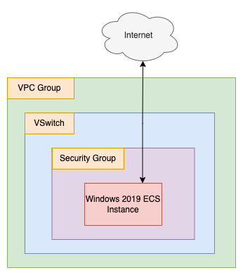

# Chrome On Windows

- Terraform Version: v1.1.2
- Alibaba Cloud Provider Version: v1.148.0
- Status: Script working as of 2021-12-21 (YYYY-MM-DD)

## What

This terraform script sets up a Windows Server 2019 instance and automatically installs the Chrome browser using a PowerShell script borrowed from [here](https://medium.com/@uqualio/how-to-install-chrome-on-windows-with-powershell-290e7346271). 

Once the script has run, it outputs login information, so that you can log into the newly created ECS instance using an RDP client.

Directory contents:

```
.
├── README.md
├── diagrams
│   ├── chrome_on_windows.png
│   └── chrome_on_windows.xml
├── install_chrome.ps1
├── main.tf
├── outputs.tf
├── terraform.tfvars.example
└── variables.tf
```

The README and diagrams (done using [draw.io](https://about.draw.io/)) are here for explanatory purposes. The files you probably care about are:

- `main.tf` (creates a VPC group, VSWitch, Security Group, and an ECS instance)
- `variables.tf` (variables used in main.tf)
- `outputs.tf` (outputs the public IP, username, and password of the ECS instance, for RDP access)
- `install_chrome.ps1` (PowerShell script to fetch and install Chrome)
- `terraform.tfvars.example` (an example terraform.tfvars file, copy this to `terraform.tfvars` and fill in the missing values before running terraform)

## Why

Sometimes, you just need a remote desktop session somewhere else. Maybe for testing connectivity or load times for a website or application. Why install Chrome? Because it's less of a pain to use than Microsoft's own browser, that's why. 

## How

First, copy `terraform.tfvars.example` to `terraform.tfvars`. Fill in your access key, access key secret, and a password for the Windows 2019 instance the terraform script will create for us. Then, open a terminal and "cd" into the chrome-on-windows directory, and run:

```
terraform init
```

If you want to confirm the set of resources terraform will create or change, then run `terraform plan`, otherwise, just directly run:

```
./setup.sh
```

This will set up a Windows Server ECS instance and automatically install the Chrome browser. When you are done with this ECS instance, run:

```
./destroy.sh
```

This will automatically destroy the ECS instance and its associated resources (security groups, VPC group, etc...). That's it!

## Notes and Warnings

**Note: If Chrome fails to install, you may need to change the URL referenced in `install_chrome.ps1`.** You can find the Chrome installation bundles [here](https://cloud.google.com/chrome-enterprise/browser/download/#download) on Google's site.

## Architecture

The architecture for this system is as follows:



The architecture is very simple. Only a single ECS instance, VSWitch, Security Group, and VPC group are created. The idea is to keep things as simple as possible here!