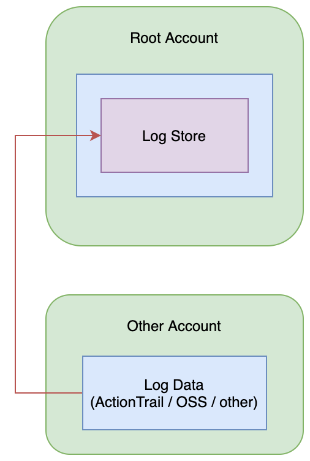

# Cross Account ActionTrail Logs

- Terraform Version: v0.12.13
- Alibaba Cloud Provider Version: v1.63.0
- Status: Script working as of 2020-02-05 (YYYY-MM-DD)

## What

Enterprise users will often have one account per team or project, but still have a requirement for centralized logging and auditing. 

On Alibaba Cloud, this need is met via a product called "日志审计服务" (Log Audit Service), which can collect ActionTrail information, as well as logs from several other products such as NAS and OSS. 

Unfortunately, for users with a large number of accounts, setting up Log Audit Service requires entering Access Key information from multiple accounts into the Log Service console, one by one.

This script semi-automates Log Audit Service configuration by automatically creating the RAM roles and policies the service needs under each of your Alibaba Cloud accounts. 

In this way, configuring Log Audit Service is reduced to a **single manual step**: you enter a list of your account ID numbers into the Log Audit Service console, then you can start collecting logs right away! 

## How

Let's say you have two accounts, we'll call them *root* and *other*.

- The *root* account is where you will store logs from all your other accounts
- The *other* account is - well - one of your other accounts

This script will create a set of roles and policies under both accounts which allow Log Service in the *root* account to use the *sts:AssumeRole* function to gain access to the *other* account. 

Once Log Service gains access, it will copy logs from the *other* account into a Log Service project in the *root* account. 

## Why

Logging and monitoring is a pain in a multi-account environment. But it doesn't have to be.

This script makes it just a little bit easier.

## How

First, copy `terraform.tfvars.example` to `terraform.tfvars`. Fill in the required information (UIDs, keys, secrets) for your two Alibaba Cloud accounts.

Then, from the terminal, run:

```
terraform init
```

If you want to confirm the set of resources terraform will create or change, then run `terraform plan`, otherwise, just directly run:

```
./setup.sh
```

This will everything up for you. **At this point, I recommend logging into your *other* account** and taking some actions (such as creating and destroying resources). Wait a few minutes, and see if you can see these actions show up in the logs under the *root* account. Once you're satisfied everything is working, run:

```
./destroy.sh
```

This will automatically destroy everything for you.

## Architecture

The architecture for this system is as follows:


