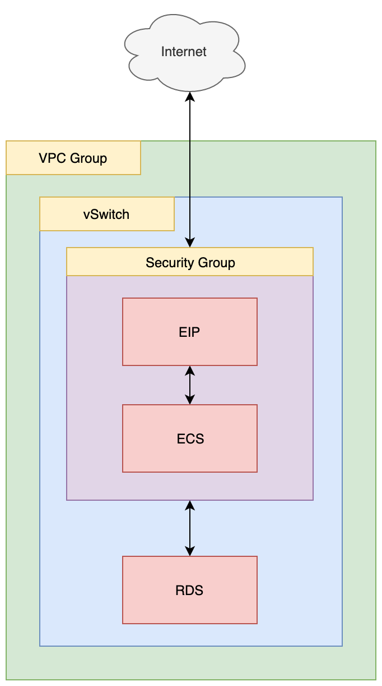

# ownCloud on Alibaba Cloud

- Terraform Version: v1.0.5
- Alibaba Cloud Provider Version: v1.133.0
- Status: Script working as of 2021-09-02 (YYYY-MM-DD)

## What

This terraform script sets up ownCloud (the open source file sharing and document management solution) on an ECS instance running Ubuntu 20.04. A separate RDS database is also configured, rather than locally installing MySQL. An EIP is assigned to the ECS instance so that the instance can be replaced in the future without the need to change the public IP address associated with ownCloud.

Once the script has run, it outputs login information for the ECS instance, as well as all the database configuration information needed by the ownCloud setup page. All you need to do after running "terraform apply" is visit the public IP address of the ECS instance (the EIP IP address) in a web browser, and enter the database connection information output by the terraform script (database name, database username, database password, and connection string). It's that easy!

Directory contents:

```
.
├── README.md
├── diagrams
│   ├── document_management_system.drawio
│   └── document_management_system.png
├── install_ownCloud.sh
├── main.tf
├── outputs.tf
└── variables.tf
```

The readme and diagrams (done using [draw.io](https://about.draw.io/)) are here for explanatory purposes. The files you probably care about are:

- main.tf (create a VPC group, security group, vSwitch, ECS instance, EIP, and an RDS instance)
- variables.tf (variables used in main.tf)
- outputs.tf (outputs database connection info and ECS instance login information for SSH)
- install_ownCloud.sh (fetches and installs apache2, PHP, and ownCloud packages, and does some configuration to change apache2 to point at /var/www/owncloud)

## Why

Your customer may not be sure *why* they need cloud services. Virtually every small to medium sized business could use a document management and sharing system. This script makes it very easy to create a demo system to show to customers.

## How

From your command line, "cd" into this directory. Then run:

```
terraform init
```

And then:

```
./setup.sh
```

That's it! In a few minutes you'll have a working ownCloud document sharing system! When (or if) you want to delete all the resources created by running `./setup.sh`, simply run:

```
./destroy.sh
```

## Notes and Warnings

### Security

Before using ownCloud in production, **you should absolutely, *DEFINITELY* enable SSL**. You can get an SSL certificate *entirely for free* from the Let's Encrypt project. A full guide to [setting this up on Ubuntu 20.04](https://www.digitalocean.com/community/tutorials/how-to-secure-apache-with-let-s-encrypt-on-ubuntu-20-04) is available on the DigitalOcean website.

### Login

You can log into the instance like so:

```
ssh -i name_of_key.pem root@instance_ip_address
```

**However**, you may need to restrict the permissions on the .pem file to avoid an angry warning from SSH. You can do that like so:

```
chmod go-rwx name_of_key.pem
```

### SSH Key Management

Also, **the SSH key .pem file will not be deleted when you call `terraform destroy`**. You must remove it by hand if you choose to call `terraform destroy` yourself instead of using `./destroy.sh`.

### Waiting Period

You should wait a little while for the script install_ownCloud.sh to complete its work before trying to visit the instance's public IP address. Typically, all setup should be done within 2-3 minutes of terraform reporting successful resource creation.

## Architecture

The architecture for this system is as follows:



This architecture could easily be expanded by decoupling ownCloud's document storage (say, using Alibaba Cloud's NAS) and then creating an auto-scaling group to allow ownCloud to scale in and out as demand changes.
