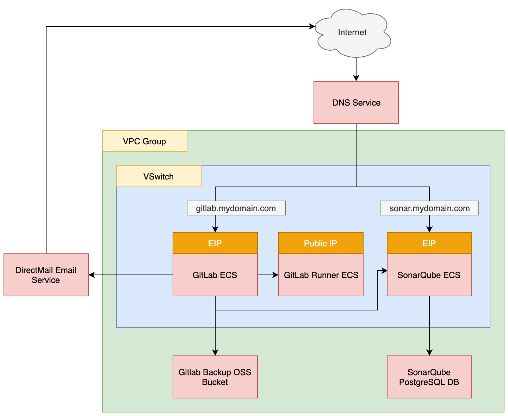

# GitLab CI/CD

- Terraform Version: 0.12.13
- Ansible Version: 2.9.4
- Alibaba Cloud Provider Version: 1.71
- Status: Script working as of 2020-02-25 (YYYY-MM-DD)

## What

A GitLab-based CI/CD pipeline based on Alibaba Cloud's comprehensive [DevOps Tutorial](https://alibabacloud-howto.github.io/devops/).

The scripts here create and configure the Alibaba Cloud resources necessary to have a fully functional CI/CD pipeline that deploys a toy "Todolist" application written in Java (backend) and JavaScript (frontend). Specifically 

The pipeline includes sophisticated features such as:
- Automatic building and testing of the sample application code using GitLab, Docker, and SonarQube
- Automatic deployment of dev, pre-prod, and production environments using terraform and packer
- The toy application is deployed using **immutable infrastructure** best practices
- Automatic warnings on build failure / code quality check failure, via email (GitLab + DirectMail)

## Prerequisites

Before running the Ansible and Terraform scripts located here, you should make sure the following prerequisites are met:

1. You have purchased a domain name using your Alibaba Cloud account (a low-cost .xyz domain will work fine)
2. You have set up a RAM account and Access Key pair for Terraform to use (see [the docs](https://www.alibabacloud.com/help/doc-detail/121941.htm) for help)

Note: due to a limitation in DirectMail, **your domain name *must* be shorter than 28 characters** in order to work. This includes the domain prefix you attach when setting up DirectMail, such as "mail.mydomain.com". So, for instance:

- 'mail.lookhowcoolmylongdomainnameis.com', which is 38 characters, *will not* work
- 'mail.mysite.com', which is 15 characters, *will* work

You should also make sure you are using:

- Ansible 2.9.x
- Terraform 0.12.x

Your machine should also offer a bash or bash-compatible shell and basic Unix utilities such as `awk` and `sed`. 

## Resources Created

Running the scripts here will create the following resources:

- 3x ECS (GitLab host, GitLab runner host, SonarQube host)
- 1x RDS (SonarQube PostgreSQL database)
- 1x OSS (GitLab backups, Terraform state and SSL certs for 'todolist' app)
- 1x DirectMail (**created manually** via the Alibaba Cloud console)

Depending on which version of the sample 'todolist' application you deploy, you will also end up with these additional resources:

3x SLB (todolist application load balancers for dev, pre-prod, and prod environments)
3x ECS (SSL certificate management machines for dev, pre-prod, and prod environments)
6x ECS (todolist application servers for dev, pre-prod, and prod environments)
3x RDS (todolist MySQL database servers for dev, pre-prod, and prod environments)

These numbers assume you have configured development, production, and pre-production environments for the 'todolist' application. **You will be charged for these resources while they are running** so consider tearing down and rebuilding this environment as-needed. At minimum, you could stop the ECS instances when not in use, or make snapshots of their disks and then recreate them later as-needed.

## Why?

The concept of "DevOps" is broad and encompasses a lot of different tools and ways of doing things. Cultivating a CI/CD workflow also takes time and involves solving numerous complex issues around application deployment, logging, and debugging. Having a toy environment to play with and serve as a model for future applications can help you better understand which direction you should take in adopting your own *DevOps Best Practices*.

## How

1. Make sure you've met all the conditions in the 'Prerequisites' section, above
2. Log into the Alibaba Cloud console
3. Go to the Direct Mail console, and create a new Email Domain, I recommend doing this in the 'Singapore' region if you are located outside China, and choosing the prefix 'mail.' as your Email Domain (as in 'mail.mysite.com')
4. Copy the file `terraform.tfvars.example` to `terraform.tfvars`, and fill in the necessary info including your Access Key and DirectMail DNS configuration information (click on 'Configure' next to your Email Domain in DirectMail to see the required DNS info)
5. Run `terraform plan` and make sure there are no obvious problems
6. Run `./setup.sh`
7. Once setup completes, go back to the DirectMail console and click on 'Verify' next to your Email Domain
8. Once you pass verification, create a 'Sender Address' in the DirectMail console
9. Set an SMTP password for DirectMail, from the Sender Address page
10. Copy the new SMTP password into ansible/group_vars/gitlab on the `directmail_password: ` line
11. Run `./configure.sh`
12. Once the script complete, you should be able to visit the URLs of your GitLab and SonarQube installations ('sonar.mysite.com' and 'gitlab.mysite.com', unless you have changed the prefixes) and finish installation by hand

## Post Installation Steps

For the steps required to set up environment variables in GitLab, set up Quality Gates in SonarQube, and create a repo to hold the 'todolist' sample app, please see the [DevOps Tutorial](https://alibabacloud-howto.github.io/devops/) mentioned at the beginning of the README.

## Notes and Warnings

Running `./destroy.sh` will destroy the resources created directly by these scripts, but will *not* delete the application environments created for the 'todolist' example application. Those have to be deleted *by hand* or by copying the terraform files and state from GitLab and OSS to somewhere else, then running `terraform destroy` by hand. Keep in mind that **running `./destroy.sh` will wipe out the OSS bucket holding the 'todolist' application's terraform state files**, so you may want to delete the 'todolist' application's resources *first*, then run `./destroy.sh`. If you fail to do this, you'll have no choice but to delete all resources created by the 'todolist' application *by hand*. 

You will also need to manually clean up DirectMail (and possibly some DNS records) after `./destroy.sh` is run. 

## Architecture

The full pipeline looks like this:

