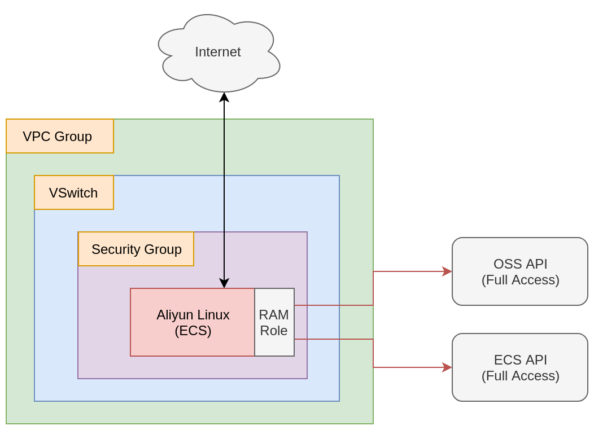

# RAM Custom Policy Demo 

- Terraform Version: v0.12.6
- Alibaba Cloud Provider Version: v1.63
- Status: Script working as of 2019-12-18 (YYYY-MM-DD)

See this script in action [on YouTube](https://www.youtube.com/watch?v=q4c5Nkv7JFA&feature=youtu.be)!

## What

This script demonstrates how to automatically create a custom [RAM Policy](https://www.alibabacloud.com/help/doc-detail/100680.htm) and bind it to an ECS instance.

This is the "best practice" for accessing other cloud services from ECS: wherever possible, you should avoid storing Access Keys and Secrets on your ECS instances. 

## Why

Writing custom RAM policies can be challenging. This example can get you up to speed quickly, so you have a better understanding of how RAM Policy works, and can incorporate it into your own Terraform code.

## How 

To run the terraform scripts located here, open a terminal and navigate to the directory holding this README, then type in:

```
./setup.sh
```

That should automatically execute `terraform apply`. If you are curious about what terraform will do, then before running setup.sh, you can run `terraform plan` like this:

```
terraform plan
```

When you are done playing aand are ready to delete all the resource created by terraform, run:

```
./destroy.sh
```

## Notes and Warnings

If you choose to execute `terraform destroy` by hand instead of using using `./destroy.sh`, be aware that the SSH key .pem file will **not** be deleted by terraform. This can cause problems if you try to execute `./setup.sh` or `terraform apply` again in the future, as this old .pem file will prevent a new .pem keyfile from being written, which will **cause your login attempts to fail**.

## Architecture

Once `./setup.sh` has run successfully, you end up with an architecture that looks like this:


