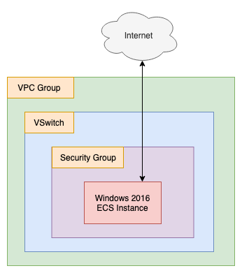

# Remote State Example

- Terraform Version: 0.12
- Alibaba Cloud Provider Version: 1.63
- Status: Script working as of 2019-12-27 (YYYY-MM-DD)

See this script in action [on YouTube](https://www.youtube.com/watch?v=Ywf6B0pjKZE&feature=youtu.be)!

## What

This terraform script demonstrates how to use the [OSS Backend](https://www.terraform.io/docs/backends/types/oss.html). In Terraform, *backends* allow you to store your terraform *state* (.tfstate files) somewhere other than the local directory that holds your terraform code.

## Why

Using the OSS Backend to store state remotely is very useful if your code is updated and run by multiple people, or if you want to be sure that the current state of your infrastructure is preserved somewhere safe, away from any local copy of your Terraform code you might have cheked out from a repository like GitHub.

## How

Before doing anything else, you'll need to create an OSS bucket and a TableStore instance in the region you'd like to store your terraform state in (typically the same region where you will deploy your infrastructure). 

Also, in order to avoid hard-coding an Acess Key and Access Key Secret into your main.tf file, you should export the following environment variables:

```
export ALICLOUD_ACCESS_KEY="my_access_key"
export ALICLOUD_SECRET_KEY="my_access_key_secret"
```

**Q: Why do I need to do this?** 
A: In most parts of terraform, you can supply a value like a region name or Access Key using a regular terraform variable in the form `${var.varname}`. The `terraform{}` block used to configure the OSS backend does not support this. Your options are either to hard-code your access key information into the `terraform{}` block (a Really Bad Idea™), or supply the Acess Key and Access Key Secret as environment variables (a Much Better Idea™).

Look for the following code at the top of `main.tf` and fill in the correct region, OSS Bucket, and Table Store information:

```
terraform {
  backend "oss" {
    bucket = "my-bucket-name" # Name of your OSS bucket (create this by hand first, via the console)
    key = "terraform.tfstate" # Name of your state file
    region = "ap-southeast-1" # Region which your OSS bucket belongs to
    tablestore_endpoint = "https://tfstate-table.ap-southeast-1.ots.aliyuncs.com" # TableStore Endpoint (see Alibaba Cloud Console)
    tablestore_table = "statelock" # Table Name (create this table yourself first, via the console)
  }
}
```

Once you've done that, go ahead and run:

```
terraform init
```

You can then run the terraform itself by calling the setup script:

```
./setup.sh
```

And destroy the resulting environment (a Windows instance, VPC group, vSwitch, and Security Group), like so:

```
./destroy.sh
```

## Other Stuff To Try

You'll see there's a subdirectory in this repo called `remote-state-data-source`. It contains its own `main.tf`, `variables.tf`, `outputs.tf`, and `terraform.tfvars`. You can safely ignore this code unless you are interested in playing around with Terraform's ["remote state" data source](https://www.terraform.io/docs/providers/terraform/d/remote_state.html). The code demonstrates how you can pull data from an existing remote state file into a new terraform script. You can run `terraform init`, `terraform plan`, and `terraform apply` on this code, as it has its own standalone `main.tf` file. It doesn't actually modify the terraform state or create any new resources: instead it simply produces a single output: information about the VPC group created by the root main.tf file, `remote-state-example/main.tf`. 

For an example of how to use the remote-state data source when using the `oss` backend (Alibaba Cloud's remote state backend), see [this page](https://www.terraform.io/docs/backends/types/oss.html). 

## Architecture

The script sets up a single VPC group with a single vSwitch and Security Group, then creates a Windows 2016 instance and installs the Chrome browser on it by running a PowerShell script (`install_chrome.ps1`). The architecture is as below:


