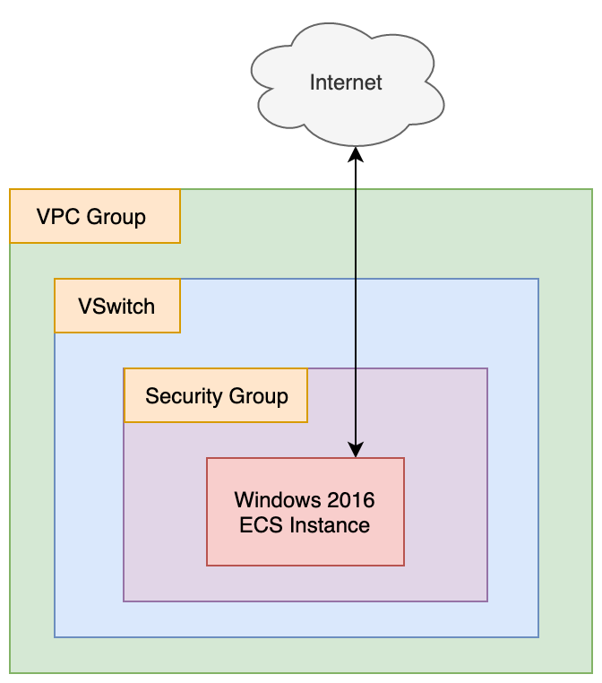

# SSH On Windows

- Terraform Version: v0.12.13
- Alibaba Cloud Provider Version: v1.58.0
- Status: Script working as of 2020-02-12 (YYYY-MM-DD)

## What

This terraform script sets up a Windows Server 2019 instance and automatically installs both Chrome and SSH. It's a simple extension of my chrome-on-windows code. I have simply modified the associated PowerShell script to set up OpenSSH, which is provided in Windows Server 2019 as an optional feature.

The Chrome browser PowerShell code is borrowed from [here](https://medium.com/@uqualio/how-to-install-chrome-on-windows-with-powershell-290e7346271). 

Once the script has run, it outputs login information, so that you can log into the newly created ECS instance using either SSH or RDP.

## Why

There are lots and lots of cases when you might want to use OpenSSH:
- You are managing a heterogeneous environment (Windows and Linux) and don't want to have to handle both WinRM and SSH
- You are an ops person or from an ops team, and your team is already familiar with SSH but not with WinRM
- You don't want to deal with WinRM's certificate management
- You are running headless windows servers so RDP isn't an option for you

## How

First, copy `terraform.tfvars.example` to `terraform.tfvars`. Fill in your access key, access key secret, and a password for the Windows 2019 instance the terraform script will create for us. Then, open a terminal and "cd" into the ssh-on-windows directory, and run:

```
terraform init
```

If you want to confirm the set of resources terraform will create or change, then run `terraform plan`, otherwise, just directly run:

```
./setup.sh
```

This will set up a Windows Server ECS instance and automatically install the Chrome browser. When you are done with this ECS instance, run:

```
./destroy.sh
```

This will automatically destroy the ECS instance and its associated resources (security groups, VPC group, etc...). That's it!

## Notes and Warnings

**Note: If Chrome fails to install, you may need to change the URL referenced in `install_chrome_ssh.ps1`.** You can find the Chrome installation bundles [here](https://cloud.google.com/chrome-enterprise/browser/download/#download) on Google's site.

## Architecture

The architecture for this system is as follows:



The architecture is very simple. Only a single ECS instance, VSwitch, Security Group, and VPC group are created. The idea is to keep things as simple as possible here!