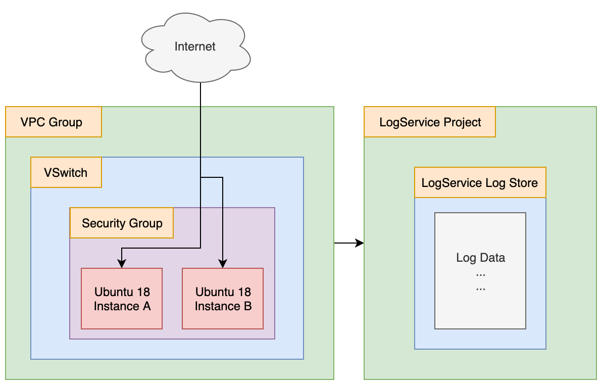

# VPC FlowLogs On Alibaba Cloud

- Terraform Version: v0.12.6
- Alibaba Cloud Provider Version: v1.67
- Status: Script working as of 2019-12-30 (YYYY-MM-DD)

See this script in action [here, on YouTube](https://www.youtube.com/watch?v=x16Z7WsRUrg&feature=youtu.be).

## What

This script creates a test environment used to showcase a new feature of Alibaba Cloud VPC groups: the *VPC FlowLog*. FlowLogs allow you to capture network traffic traversing the ENIs (Elastic Network Interfaces) attached to your ECS instance.

Currently, this function is supported only for 6th generation ECS instances and only in a few select regions (such as Hohhot and Malaysia).

## Why

Being able to quickly stand up a test environment in which to try out new features is important. It gives me (and you!) and opportunity to quickly stand up a test environment, try things out, and then decide what use-cases to apply VPC FlowLogs to.

## How 

To run the terraform scripts located here, open a terminal and navigate to the directory holding this README, then type in:

```
./setup.sh
```

That should automatically execute `terraform apply`. If you are curious about what terraform will do, then before running setup.sh, you can run `terraform plan` like this:

```
terraform plan
```

When you are done playing and are ready to delete all the resource created by terraform, run:

```
./destroy.sh
```

## Notes and Warnings

If you choose to execute `terraform destroy` by hand instead of using using `./destroy.sh`, be aware that the SSH key .pem file will **not** be deleted by terraform. This can cause problems if you try to execute `./setup.sh` or `terraform apply` again in the future, as this old .pem file will prevent a new .pem keyfile from being written, which will **cause your login attempts to fail**.

## Architecture


