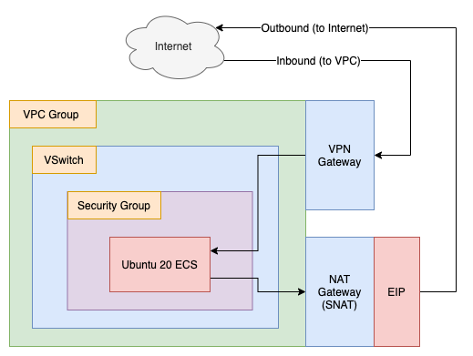

# VPN Gateway and NAT Gateway Setup: A Demo 

- Terraform Version: v0.14.5
- Alibaba Cloud Provider Version: v1.113.0
- Status: Script working as of 2021-01-26 (YYYY-MM-DD)

See this script in action [on YouTube](https://www.youtube.com/watch?v=K_n-rLNxNks&feature=youtu.be)!

## What

This script sets up a VPN Gateway and NAT Gateway attached to a VPC group, then creates a single ECS instances inside the VPC.

The ECS instance does not have a public IP address, so all Internet access is via the NAT Gateway (outbound) and VPN Gateway (inbound).

## Why

Network setup on the cloud is something new users struggle with. This script serves as a starting point for new users trying to understand how VPN Gateways and NAT Gateways can be attached to VPC groups and configured properly (SNAT rule configuration, Elastic IP binding, SSL VPN configuration, etc...).

## How 

To run the terraform scripts located here, open a terminal and navigate to the directory holding this README, then type:

```
./setup.sh
```

That should automatically execute `terraform apply`. If you are curious about what terraform will do, then before running setup.sh, you can run `terraform plan` like this:

```
terraform plan
```

When you are done playing and are ready to delete all the resource created by terraform, run:

```
./destroy.sh
```

## Notes and Warnings

If you choose to execute `terraform destroy` by hand instead of using `./destroy.sh`, be aware that the ECS instance's SSH key (`.pem` file) will **not** be deleted by terraform. This can cause problems if you try to execute `./setup.sh` or `terraform apply` again in the future, as this old `.pem` file will prevent terraform from downloading the new key generated the next time the script is run, which will **cause your login attempts to fail**.

## Architecture

Once `./setup.sh` has run successfully, you end up with an architecture that looks like this:


