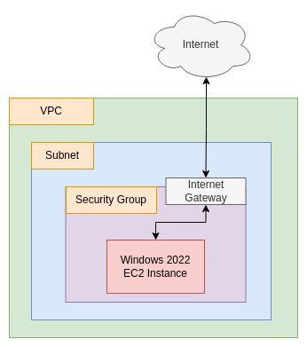

# Chrome On Windows (on AWS!)

- Terraform Version: v1.3.6
- AWS Provider Version: v4.47.0
- Status: Script working as of 2022-12-19 (YYYY-MM-DD)

## What

This terraform script sets up a Windows Server 2022 instance and automatically installs the Chrome browser using a PowerShell script borrowed from [here](https://medium.com/@uqualio/how-to-install-chrome-on-windows-with-powershell-290e7346271). 

Once the script has run, it outputs login information, so that you can log into the newly created ECS instance using an RDP client.

## Why

Sometimes, you just need a remote desktop session somewhere else. Maybe for testing connectivity or load times for a website or application. Why install Chrome? Because sometimes you just don't want to use Edge. 

## How

First, copy `terraform.tfvars.example` to `terraform.tfvars`. Fill in your access key and access key secret, and optionally set the region in which to launch your instance (defaults to Singapore). Then, from the terminal, make sure you run:

```
terraform init
```

You should then generate an SSH key. I've included a script to do this for you:

```
./keysetup.sh
```

After that, if you want to confirm the set of resources terraform will create or change, you can run `terraform plan`, otherwise, just directly run:

```
./setup.sh
```

This will set up a Windows Server 2019 EC2 instance and automatically install the Chrome browser. When you are done with this EC2 instance, run:

```
./destroy.sh
```

This will automatically destroy the instance and associated resources. That's it!

## Notes and Warnings

**Note: If Chrome fails to install, you may need to change the URL referenced in `install_chrome.ps1`.** You can find the Chrome installation bundles [here](https://cloud.google.com/chrome-enterprise/browser/download/#download) on Google's site.

## Architecture

The architecture for this system is as follows:



The architecture is very simple, just a single instance in a single VPC. 