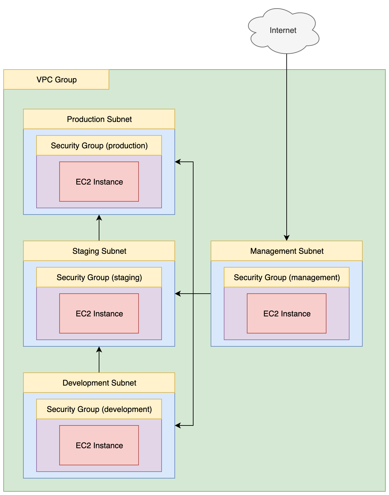

# Subnets: Development, Staging, and Production

- Terraform Version: v0.12.13
- AWS Provider Version: v2.45
- Status: Script working as of 2020-01-21 (YYYY-MM-DD)

## What

This terraform script sets up a new VPC group with four subnets:

- management
- development
- staging
- production

The script then launches 4 EC2 instances, one in each subnet. The VPC group holding the 4 subnets has 4 different security groups, designed to restrict traffic into and out of each subnet. When the script runs, the EC2 in the "management" subnet is bound to the "management" Security Group, the "development" EC2 instance to the "development" Security Group, and so on.

The management instance uses an SSH key for login, while all other instances use a password (for convenience rather than security, so that you do not need to upload a local SSH key to the management instance before logging in to other instances). The SSH key will be created when `terraform apply` is run, and will appear in the same folder as main.tf. You can log into the management SSH instance using a command like this one:

```
ssh -i name_of_key.pem ubuntu@instance_ip_address
```

You may need to restrict the permissions on the key file to avoid an angry warning from SSH. You can do that like so:

```
chmod go-rwx name_of_key
```

## Why

The script demonstrates how it is possible to configure Security Group rules to allow TCP connections in *only one direction* between different subnets. For instance, Security Group rules can be configured so that machines in group A can initiate SSH connections to machines in group B, but machines in group B cannot initiate new SSH connections to machines in group A.

The rules in main.tf are configured like so:

management subnet:

- Traffic from the **internet** **IN** to the **management** subnet is allowed on port 22 (TCP only)
- Traffic from the **management** subnet **OUT** to the **development** subnet is allowed on any port and protocol
- Traffic from the **management** subnet **OUT** to the **staging** subnet is allowed on any port and protocol
- Traffic from the **management** subnet **OUT** to the **production** subnet is allowed on any port and protocol

development subnet:

- Traffic from the **management** subnet **IN** to the **development** subnet is allowed on any port and protocol
- Traffic from the **development** subnet **OUT** to the **staging** subnet is allowed on any port and protocol

staging subnet:

- Traffic from the **management** subnet **IN** to the **staging** subnet is allowed on any port and protocol
- Traffic from the **development** subnet **IN** to the **staging** subnet is allowed on any port and protocol
- Traffic from the **staging** subnet **OUT** to the **production** subnet is allowed on any port and protocol

production subnet:

- Traffic from the **management** subnet **IN** to the **production** subnet is allowed on any port and protocol
- Traffic from the **staging** subnet **IN** to the **production** subnet is allowed on any port and protocol

This results in an architecture where:

- Traffic flow from development -> staging -> production is one-way
- Management (bastion host) can connect to hosts in any other subnet, but those other subnets cannot initiate a connection to the management machine (bastion host).

## How 

From your command line, "cd" into the dev-staging-test-subnets directory, then run:

```
terraform init
```

Followed by:

```
./setup.sh
```

This will automatically create the architecture described above (4 EC2 instances, as well as supporting network resources and security group rules, which will be created automatically). Once this is done you'll be able to SSH into the bastion host, and from there you should be able to log into the development, staging, and production EC2 instances. 

Once you are satisfied that the security group rules are working, you can destroy the environment using this command:

```
./destroy.sh
```

## Notes and Warnings

Note: **the SSH key .pem file will not be deleted if you call `terraform destroy` directly instead of using hte `./destroy.sh` script**. In this case, you must remove the .pem file by hand. If you fail to delete the .pem file and run `terraform apply` or `./setup.sh` again following `terraform destroy`, then terraform may not overwrite your old .pem file with the new SSH key data, leaving you unable to log into your new instances!

## Architecture

Once `terraform apply` has run successfully, you will end up with an architecture that looks like this:



Note the direction of the arrows between subnets (indicating the direction in which traffic is allowed to flow）.
