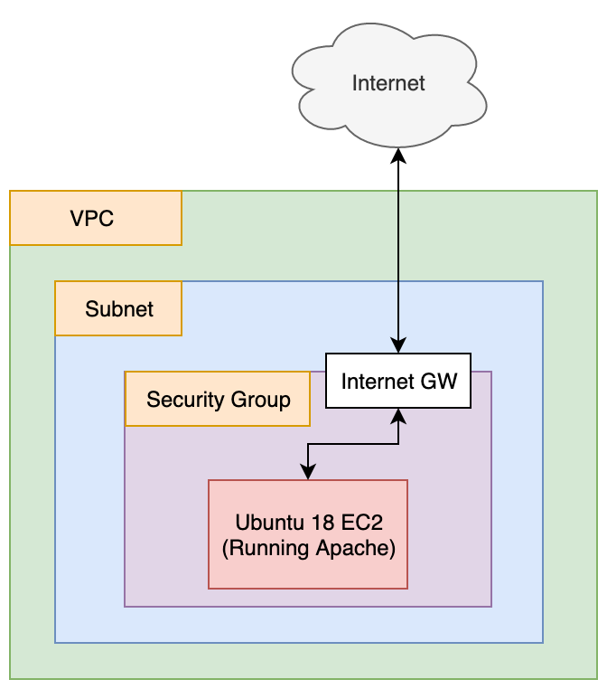

# Terraform On AWS: A Simple Example

- Terraform Version: v0.12.13
- AWS Provider Version: v2.43
- Status: Script working as of 2020-01-06 (YYYY-MM-DD)

Curious to see how the script works? See a demo [here](https://www.youtube.com/watch?v=uMdw_BbeYAM) on YouTube. 

## What

This script creates a single EC2 instance with Apache installed. The script's purpose is to illustrate how to use terraform with AWS.

## Why

I wanted to have a "bare minimum" script to demonstrate how to stand up an EC2 instance and install software from a terraform script. I ended up extending things a little bit to include setting up a VPC group. For new users of AWS, setting up a (non-default) VPC group can be challenging, because it involves multiple steps (you must set up a VPC, a VPC subnet, an internet gateway, a custom route table, and then a route table association...only then can your EC2 instances access the internet!). This script helps to document those steps. 

## How 

To run the terraform scripts located here, open a terminal and navigate to the directory holding this README, then type in:

```
./setup.sh
```

That should automatically execute `terraform apply`, in addition to running `ssh-keygen` to create an SSH key for EC2 instance login. If you are curious about what terraform will do, then before running setup.sh, you can run `terraform plan` like this:

```
terraform plan
```

**Warning:** `terraform plan` will fail if you have not yet generated an SSH key. Have a look at the first line in `setup.sh` to see how that's done.

When you are done playing with the environment and are ready to delete all the resources created by terraform,simply run:

```
./destroy.sh
```

## Notes and Warnings

If you choose to execute `terraform destroy` manually instead of using using `./destroy.sh`, be aware that your SSH key file will **not** be deleted by terraform. This could cause problems if you try to execute `./setup.sh` or `terraform apply` again in the future, as this old key file may prevent you from logging into newly created EC2 instances. **For this reason, I recommend you use the `./setup.sh` and `./destroy.sh` scripts whenever possible**. 

## Architecture

Once `./setup.sh` has run successfully, you end up with an architecture that looks like this:


